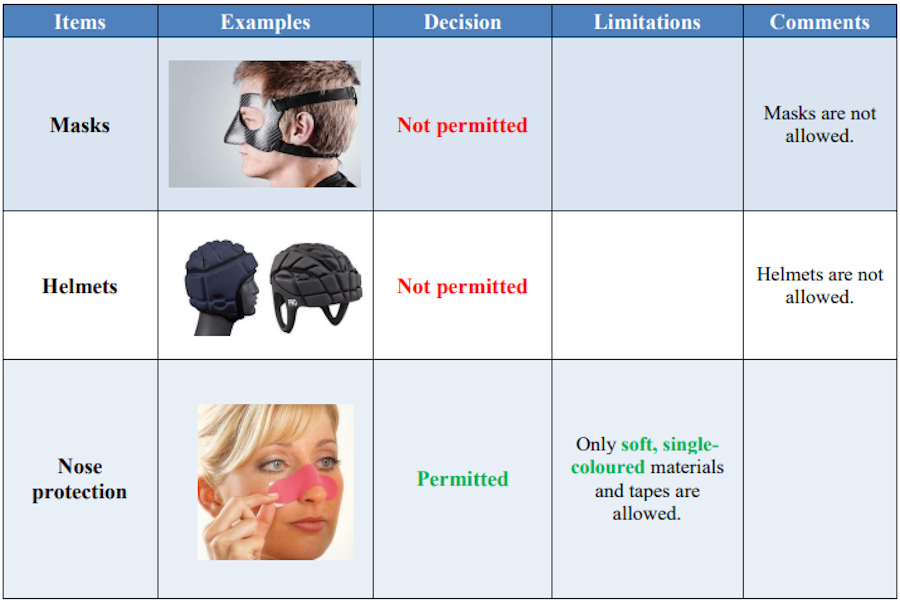
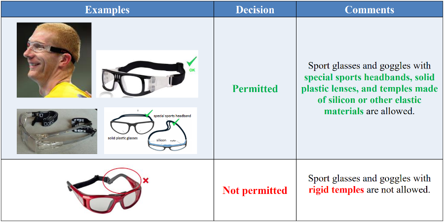
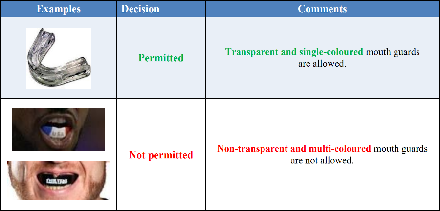
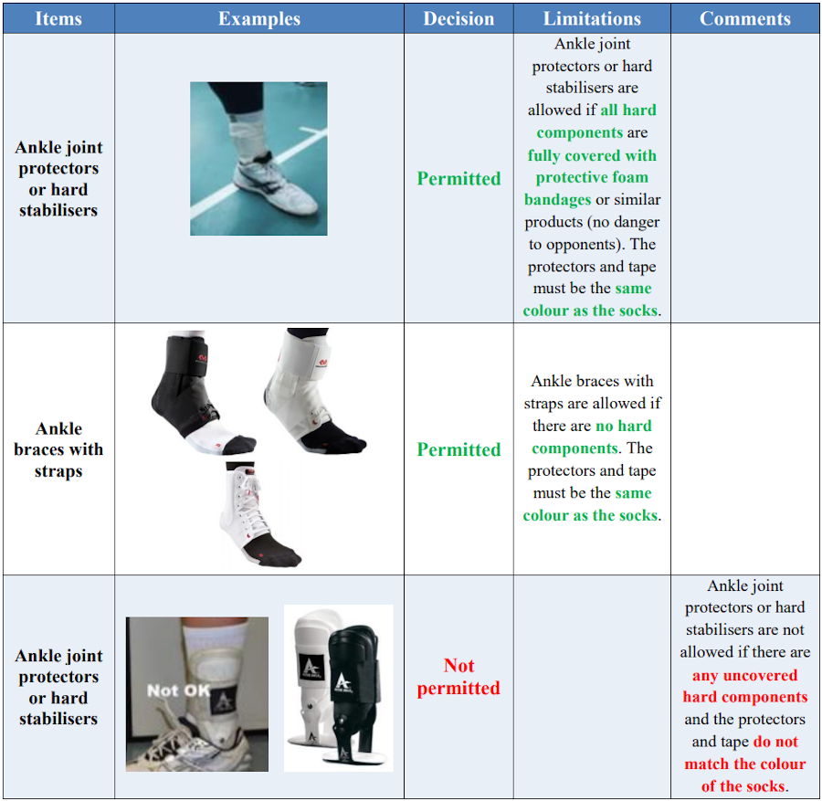
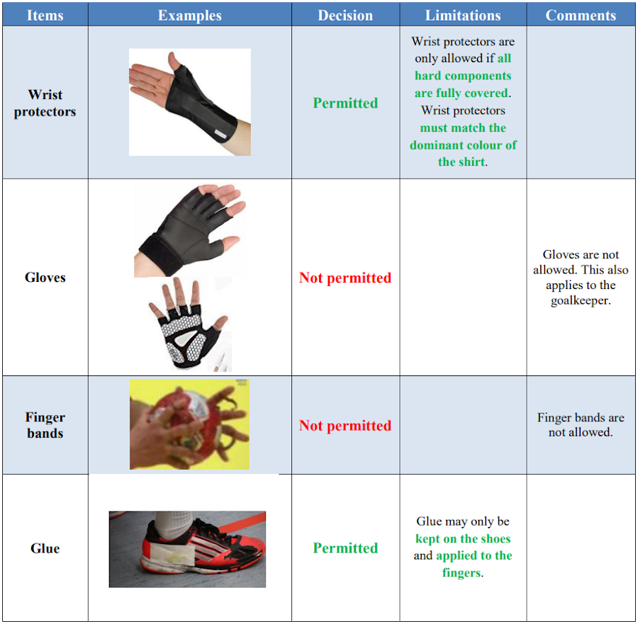

# Ausrüstungsreglement

Edition: Juli 2017

Source: https://www.ihf.info/sites/default/files/2019-07/0_Regulations%20on%20Protective%20Equipment%20and%20Accessories_GB.pdf

## 1. Kopf- und Gesichtsschutz

## 2. Stirnbänder

## 3. Schutzbrillen

## 4. Mundschutz

## 5. Schulterschutz und Kompressionsbandagen

## 6. Ellbogenschutz

## 7. Knieschutz

## 8. Kompressionsstutzen

## 9. Sprunggelenkschutz

## 10. Kleidung

***Zusammenfassung:***

- Lange Hosen sind nicht erlaubt (Ausnahme: Torwart).

- Die Kombination aus Unterziehhose, Knieschützer, Kompressionsstutzen und Socken ist nur erlaubt, wenn es sich dabei um vier separate Teile handelt.

- Die Farbe von Kompressionsbandagen und langärmligen Unterziehhemden muss der Hauptfarbe des Trikots entsprechen.

- Die Farbe von Unterziehhosen muss der Hauptfarbe der Hose entsprechen.

- Die Farbe von Kompressionsstutzen muss der Farbe der Socken entsprechen.

- Die Farbe von Sprunggelenkprotektoren muss der Farbe der Socken entsprechen.

- Ellbogen- und Knieschützer sind in beliebigen Farben erlaubt.

## 11. Besondere Ausrüstungsgegenstände

