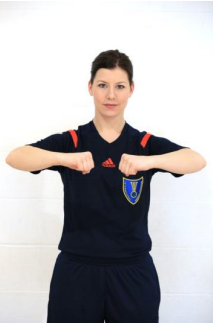
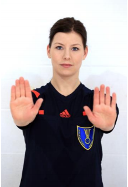
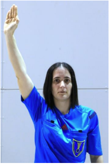

# Handzeichen

Bei Einwurf- oder Freiwurf-Entscheidungen müssen die Schiedsrichter sofort die Richtung des folgenden Wurfs anzeigen 
(Zeichen 7 oder 9).

Danach sollte(n) situationsgemäß das (die) entsprechende(n), zwingend vorgeschriebene(n) Handzeichen gegeben werden, um 
jede persönliche Strafe anzuzeigen (Zeichen 13-14).

Wenn es scheint, dass es auch nützlich wäre, den Grund für eine Freiwurf oder 7-m-WurfEntscheidung zu erklären, könnte 
das entsprechende der Zeichen 1-6 und 11 informationshalber gegeben werden. Zeichen 11 sollte jedoch immer in jenen 
Situationen gegeben werden, in denen einer Freiwurf-Entscheidung wegen passiven Spiels kein Zeichen 17 vorausgegangen 
ist.

Die Zeichen 12, 15 und 16 sind in den Situationen, in denen sie Geltung haben, zwingend vorgeschrieben.

Die Zeichen 8, 10 und 17 sind dann zu geben, wenn sie von den Schiedsrichtern als erforderlich erachtet werden.

**Liste der Handzeichen:**

1. [Betreten des Torraums](#1---betreten-des-torraums)
2. [Prell- oder Tippfehler](#2---prell--oder-tippfehler)
3. [Schritt- oder Zeitfehler](#3---schritt--oder-zeitfehler)
4. [Umklammern, Festhalten oder Stoßen](#4---umklammern-festhalten-oder-stoßen)
5. [Schlagen](#5---schlagen)
6. [Stürmerfoul](#6---stürmerfoul)
7. [Einwurf – Richtung](#7---einwurf--richtung)
8. [Abwurf](#8---abwurf)
9. [Freiwurf – Richtung](#9---freiwurf--richtung)
10. [Nichtbeachten des 3-Meter-Abstandes](#10---nichtbeachten-des-3-meter-abstandes)
11. [Passives Spiel](#11---passives-spiel)
12. [Torgewinn](#12---torgewinn)
13. [Verwarnung (gelb) – Disqualifikation (rot) - Information schriftlicher Bericht (blau)](#13---verwarnung-gelb-disqualifikation-rot-information-schriftlicher-bericht-blau)
14. [Hinausstellung](#14---hinausstellung-2-minuten)
15. [Time-out](#15---time-out)
16. [Erlaubnis für zwei teilnahmeberechtigte Personen zum Betreten der Spielfläche bei Time-out](#16---erlaubnis-fr-zwei-teilnahmeberechtigte-personen-zum-betreten-der-spielflche-bei-time-out)
17. [Vorwarnzeichen für passives Spiel](#17---vorwarnzeichen-für-passives-spiel)
 
## 1 - Betreten des Torraums

## 2 - Prell- oder Tippfehler

## 3 - Schritt- oder Zeitfehler

## 4 - Umklammern, Festhalten oder Stoßen

## 5 - Schlagen

## 6 - Stürmerfoul

## 7 - Einwurf – Richtung

## 8 - Abwurf

## 9 - Freiwurf – Richtung

## 10 - Nichtbeachten des 3-Meter-Abstandes

## 11 - Passives Spiel

## 12 - Torgewinn

## 13 - Verwarnung (gelb) Disqualifikation (rot) Information schriftlicher Bericht (blau)

## 14 - Hinausstellung (2 Minuten)

## 15 - Time-out

## 16 - Erlaubnis für zwei teilnahmeberechtigte Personen zum Betreten der Spielfläche bei Time-out

## 17 - Vorwarnzeichen für passives Spiel

